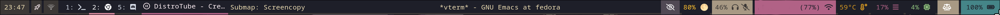

* TABLE OF CONTENTS                                            :TOC:noexport:
- [[#about][About]]
- [[#config][CONFIG]]
  - [[#waybar-position][Waybar Position]]
  - [[#module-declaration][Module Declaration]]
  - [[#module-definition][Module Definition]]
- [[#css][CSS]]
  - [[#colorscss][Colors.css]]
  - [[#stylecss][Style.css]]
- [[#footnotes][FOOTNOTES]]

* About 
#+attr_html: :width 800px :align center
Personal Gruvbox theme for /Waybar/.  

* CONFIG
#+begin_src jsonc :tangle ~/dotfiles/waybar/config.jsonc
// -*- mode: jsonc -*-
#+end_src

#+begin_src jsonc :tangle ~/dotfiles/waybar-gruvbox/config.jsonc
{
#+end_src
** Waybar Position
Define the location, width, and hieght of /Waybar/
#+begin_src jsonc :tangle ~/dotfiles/waybar-gruvbox/config.jsonc
    "layer": "top", // Waybar at top layer
    "position": "top", // Waybar position (top|bottom|left|right)
    "height": 30, // Waybar height (to be removed for auto height)
    // "width": 1280, // Waybar width
    "spacing": 4, // Gaps between modules (4px)
#+end_src

** Module Declaration
This section will name each module I want included on my /Waybar/; along with the location of each module.

*** Modules Left
Select the modules to show on the left portion of /Waybar/
#+begin_src jsonc :tangle ~/dotfiles/waybar-gruvbox/config.jsonc
  "modules-left": [
         "clock",
         "custom/rofi",
         "tray",
         "hyprland/workspaces",
         "custom/media",
      "hyprland/submap",
     ],
#+end_src

*** Modules Center
Select the modules to show on the center portion of /Waybar/
#+begin_src jsonc :tangle ~/dotfiles/waybar-gruvbox/config.jsonc
    "modules-center": [
        "hyprland/window",
    ],
#+end_src

*** Modules Right
Select the modules to show on the right portion of /Waybar/
#+begin_src jsonc :tangle ~/dotfiles/waybar-gruvbox/config.jsonc
  "modules-right": [
      "idle_inhibitor",
      "backlight",
      "pulseaudio",
      "network",
      "temperature",
      "memory",
      "cpu",
      "power-profiles-daemon",
      "battery"
  ],
#+end_src

** Module Definition
This section will include the module configuration for each module included in the /Module Declation/ section. 

*** Modules Left 
Configuration for the clock module 
#+begin_src jsonc :tangle ~/dotfiles/waybar-gruvbox/config.jsonc
  "clock": {
      // "timezone": "America/New_York",
      "tooltip-format": "<big>{:%Y %B}</big>\n<tt><small>{calendar}</small></tt>",
      "format-alt": "{:%Y-%m-%d}"
  },
#+end_src

Configuration for the custom rofi module
#+begin_src jsonc :tangle ~/dotfiles/waybar-gruvbox/config.jsonc
    "custom/rofi": {
        "format": "󱓟",
        "on-click": "$HOME/scripts/bash/rofi.sh",
        "signal": 6,
        "tooltip": false,
        "return-type": "json"
    },
#+end_src

Configuration for the tray module 
#+begin_src jsonc :tangle ~/dotfiles/waybar-gruvbox/config.jsonc
"tray": {
        // "icon-size": 21,
        "spacing": 10
    },
#+end_src

Configuration for the "hyprland/workspaces" module
#+begin_src jsonc :tangle ~/dotfiles/waybar-gruvbox/config.jsonc
  "hyprland/workspaces": {
           "disable-scroll": false,
           "all-outputs": true,
           "warp-on-scroll": false,
           "format": "{name}: {icon}",
           "format-icons": {
               "1": "",
               "2": "",
               "3": "",
               "4": "",
               "5": "󰙯",
               "6": "",
               "urgent": "",
               "focused": "",
               "default": ""
           }
       },
#+end_src

Configuration for the "custom/media" module
#+begin_src jsonc :tangle ~/dotfiles/waybar-gruvbox/config.jsonc
"custom/media": {
        "format": "{0} {1}",
        "return-type": "json",
        "max-length": 20,
        "format-icons": {
            "spotify": "",
            "default": "🎜",
        },
        "escape": true,
	"on-click": "playerctl play-pause",	    
        "exec": "$HOME/scripts/python/mediaplayer.py 2> /dev/null" // Script in resources folder
        // "exec": "$HOME/scripts/python/mediaplayer.py --player spotify 2> /dev/null" // Filter player based on name
    },
#+end_src
*** Modules Center
Configuration for the "hyprland/window" module

*** Modules Right
**** Submap
#+begin_src jsonc :tangle ~/dotfiles/waybar-gruvbox/config.jsonc
"hyprland/submap": {
  "format": "Submap: {}"
},
#+end_src
**** I/O
Configuration for the idle_inhibitor module
#+begin_src jsonc :tangle ~/dotfiles/waybar-gruvbox/config.jsonc
"idle_inhibitor": {
        "format": "{icon}",
        "format-icons": {
            "activated": "",
            "deactivated": ""
        }
    },
#+end_src

Configuration for the backlight module
#+begin_src jsonc :tangle ~/dotfiles/waybar-gruvbox/config.jsonc
"backlight": {
        // "device": "acpi_video1",
        "format": "{percent}% {icon}",
        "format-icons": ["🌑", "🌘", "🌗", "🌖", "🌕"]
    },
#+end_src

Configuration for the pulseaudio module
#+begin_src jsonc :tangle ~/dotfiles/waybar-gruvbox/config.jsonc
"pulseaudio": {
        // "scroll-step": 1, // %, can be a float
        "format": "{volume}% {icon} {format_source}",
        "format-bluetooth": "{volume}% {icon} {format_source}",
        "format-bluetooth-muted": " {icon} {format_source}",
        "format-muted": " {format_source}",
        "format-source": "{volume}% ",
        "format-source-muted": "",
        "format-icons": {
            "headphone": "",
            "hands-free": "",
            "headset": "",
            "phone": "",
            "portable": "",
            "car": "",
            "default": ["", "", ""]
        },
        "on-click": "pavucontrol"
    },
#+end_src

Configuration for the network module
#+begin_src jsonc :tangle ~/dotfiles/waybar-gruvbox/config.jsonc
"network": {
        // "interface": "wlp2*", // (Optional) To force the use of this interface
        "format-wifi": "{essid} ({signalStrength}%) ",
        "format-ethernet": "{ipaddr}/{cidr} ",
        "tooltip-format": "{ifname} via {gwaddr} ",
        "format-linked": "{ifname} (No IP) ",
        "format-disconnected": "Disconnected ⚠",
        //"format-alt": "{ifname}: {ipaddr}/{cidr}",
	"on-click": "kitty -e nmtui"
    },
#+end_src

**** Monitoring
Configuration for the temperature module
#+begin_src jsonc :tangle ~/dotfiles/waybar-gruvbox/config.jsonc
    "temperature": {
        // "thermal-zone": 2,
        // "hwmon-path": "/sys/class/hwmon/hwmon2/temp1_input",
        "critical-threshold": 80,
        // "format-critical": "{temperatureC}°C {icon}",
        "format": "{temperatureC}°C {icon}",
        "format-icons": ["", "", ""]
    },
#+end_src

Configuration for the memory module
#+begin_src jsonc :tangle ~/dotfiles/waybar-gruvbox/config.jsonc
"memory": {
        "format": "{}% "
    },
#+end_src

Configuration for the cpu module
#+begin_src jsonc :tangle ~/dotfiles/waybar-gruvbox/config.jsonc
 "cpu": {
        "format": "{usage}% ",
        "tooltip": false
    },
#+end_src

Configuration for the power profiles daemon module
#+begin_src jsonc :tangle ~/dotfiles/waybar-gruvbox/config.jsonc
"power-profiles-daemon": {
      "format": "{icon}",
      "tooltip-format": "Power profile: {profile}\nDriver: {driver}",
      "tooltip": true,
      "format-icons": {
        "default": "",
        "performance": "",
        "balanced": "",
        "power-saver": ""
      }
    },
#+end_src

Configuration for the battery module
#+begin_src jsonc :tangle ~/dotfiles/waybar-gruvbox/config.jsonc
"battery": {
        "states": {
            // "good": 95,
            "warning": 30,
            "critical": 15
        },
        "format": "{capacity}% {icon}",
        "format-full": "{capacity}% {icon}",
        "format-charging": "{capacity}% ",
        "format-plugged": "{capacity}% ",
        "format-alt": "{time} {icon}",
        // "format-good": "", // An empty format will hide the module
        // "format-full": "",
        "format-icons": ["", "", "", "", ""]
    },
    "battery#bat2": {
        "bat": "BAT2"
    }
#+end_src

#+begin_src jsonc :tangle ~/dotfiles/waybar-gruvbox/config.jsonc
  }
//]
#+end_src
*** Un-used Modules
This section includes modules from the default /Waybar/ configuration file which I do not use. These modules are placed here for reference only, and are not used in my running configuration.

#+begin_src jsonc 
  "keyboard-state": {
           "numlock": true,
           "capslock": true,
           "format": "{name} {icon}",
           "format-icons": {
               "locked": "",
               "unlocked": ""
           }
       },
#+end_src

#+begin_src jsonc 
       "sway/mode": {
           "format": "{}"
       },
#+end_src

#+begin_src jsonc 
       "sway/scratchpad": {
           "format": "{icon} {count}",
           "show-empty": false,
           "format-icons": ["", ""],
           "tooltip": true,
           "tooltip-format": "{app}: {title}"
       },
#+end_src

#+begin_src jsonc            
  "mpd": {
         "format": "{stateIcon} {consumeIcon}{randomIcon}{repeatIcon}{singleIcon}{artist} - {album} - {title} ({elapsedTime:%M:%S}/{totalTime:%M:%S}) ⸨{songPosition}|{queueLength}⸩ {volume}% ",
          "format-disconnected": "Disconnected ",
          "format-stopped": "{consumeIcon}{randomIcon}{repeatIcon}{singleIcon}Stopped ",
          "unknown-tag": "N/A",
          "interval": 5,
          "consume-icons": {
                           "on": " "
          },
          "random-icons": {
                  "off": " ",
                  "on": " "
          },
          "repeat-icons": {
                  "on": " "
          },
          "single-icons": {
                  "on": "1 "
          },
          "state-icons": {
                  "paused": "",
                  "playing": ""
          },
          "tooltip-format": "MPD (connected)",
          "tooltip-format-disconnected": "MPD (disconnected)"
  },

#+end_src 
    
#+begin_src jsonc            
"custom/power": {
        "format" : "⏻ ",
		"tooltip": false,
		"menu": "on-click",
		"menu-file": "$HOME/.config/waybar/power_menu.xml", // Menu file in resources folder
		"menu-actions": {
			"shutdown": "shutdown",
			"reboot": "reboot",
			"suspend": "systemctl suspend",
			"hibernate": "systemctl hibernate"
		}
    }
}
#+end_src 

* CSS
there are two files used to style waybar using CSS. 
** [[./colors.css][Colors.css]] 
This file defines all the colors I will use to style /Waybar/
** [[./style.css][Style.css]]
This file uses the colors from [[./colors.css][colors.css]] to style the modules of /Waybar/ to whatever look I want. 

*** Import colors from =colors.css=
Before I can style anything in the [[./style.css][style.css]] file; I need to imprt the pre-difined colors from [[./colors.css][colors.css]]  
#+begin_src css :tangle ~/dotfiles/waybar-gruvbox/style.css
@import url("./colors.css");
#+end_src

*** Global Styling
Set the font, and font size globally
#+begin_src css :tangle ~/dotfiles/waybar-gruvbox/style.css
 * {
    font-family: 'Noto Sans Mono', 'Font Awesome 6 Free', 'Font Awesome 6 Brands', monospace;
    font-size: 13px;
}
#+end_src

**** Window
#+begin_src css :tangle ~/dotfiles/waybar-gruvbox/style.css
window#waybar {
    background-color: @background-darker;
    border-bottom: 3px solid @background;
    color: @foreground;
    transition-property: background-color;
    transition-duration: .5s;
}

window#waybar.hidden {
    opacity: 0.2;
}
#+end_src

**** Button
#+begin_src css :tangle ~/dotfiles/waybar-gruvbox/style.css
button {
    /* Use box-shadow instead of border so the text isn't offset */
    box-shadow: inset 0 -3px transparent;
    /* Avoid rounded borders under each button name */
    border: none;
    border-radius: 0;
}

/* https://github.com/Alexays/Waybar/wiki/FAQ#the-workspace-buttons-have-a-strange-hover-effect */
button:hover {
    background: inherit;
    box-shadow: inset 0 -3px @pink;
}
#+end_src

*** Module Styling
**** Hover Rules
#+begin_src css :tangle ~/dotfiles/waybar-gruvbox/style.css
    #pulseaudio:hover {
        background-color: @yellow;
        padding: 1px 6px;
    }

    #network:hover {
        background-color: @yellow;
        padding: 1px 6px;
    }
    /* #workspaces button {
        padding: 0 5px;
        background-color: transparent;
        color: @foreground;
    }*/

#+end_src

**** Mode 
styling for submodes like window resizing or screenshot menus. I don't use this on Hyprland, but do on SwayWM.
#+begin_src css :tangle ~/dotfiles/waybar-gruvbox/style.css

    #mode {
        background-color: @comment;
        box-shadow: inset 0 -3px #ffffff;
    }

    #cpu,
    #memory,
    #pulseaudio,
    #wireplumber,
    #idle_inhibitor,
    #power-profiles-daemon,
    #mpd {
        padding: 0 10px;
        color: #ffffff;
    }

    #window,
#+end_src

**** Workspaces
#+begin_src css :tangle ~/dotfiles/waybar-gruvbox/style.css
    #workspaces {
        margin: 0 4px;
        color: @foreground;
        background-color: @background-darker;
        box-shadow: inset 0 -3px @background;
    }

    #workspaces button.active {
        background-color: @background-darker;
        color: @forground;
        box-shadow: inset 0 -3px @pink;
    } 
    #workspaces button:hover {
        background: @selection;
        color: @forground;
        box-shadow: inset 0 -3px @yellow
    }

    #workspaces button.focused {
        background-color: @selection;
        color: @foreground;
        box-shadow: inset 0 -3px @purple;
    }

    #workspaces button.urgent {
        background-color: @red;
    }
    /* If workspaces is the leftmost module, omit left margin */
    .modules-left > widget:first-child > #workspaces {
        margin-left: 0;
    }

    /* If workspaces is the rightmost module, omit right margin */
    .modules-right > widget:last-child > #workspaces {
        margin-right: 0;
    }

#+end_src

**** Clock
#+begin_src css :tangle ~/dotfiles/waybar-gruvbox/style.css
    #clock {
        padding: 1px 8px;
        background-color: @background;
        color: @foreground;
    }
#+end_src

**** Battery
#+begin_src css :tangle ~/dotfiles/waybar-gruvbox/style.css
  #battery {
      background-color: @cyan;
      color: @background-darker;
      padding: 1px 10px;
  }

  #battery.charging, #battery.plugged {
      color: @background-darker;
      background-color: @green;
  }

  @keyframes blink {
      to {
          background-color: #ffffff;
          color: #000000;
      }
  }

  /* Using steps() instead of linear as a timing function to limit cpu usage */
  #battery.critical:not(.charging) {
      background-color: @red;
      color: #ffffff;
      animation-name: blink;
      animation-duration: 0.5s;
      animation-timing-function: steps(12);
      animation-iteration-count: infinite;
      animation-direction: alternate;
  }

  #power-profiles-daemon {
      padding-right: 15px;
  }

  #power-profiles-daemon.performance {
      background-color: @red;
      color: @background-darker;
  }

  #power-profiles-daemon.balanced {
      background-color: @comment;
      color: #ffffff;
  }

  #power-profiles-daemon.power-saver {
      background-color: @green;
      color: @background-darker;
  }

  label:focus {
      background-color: #000000;
  }
#+end_src

**** CPU
#+begin_src css :tangle ~/dotfiles/waybar-gruvbox/style.css
    #cpu {
        background-color: @background-darker;
        color: @green;
    }

    #cpu:hover {
        background-color: @green;
        color: @background-darker;
    }
#+end_src

**** Memory
#+begin_src css :tangle ~/dotfiles/waybar-gruvbox/style.css
    #memory {
        background-color: @background-darker;
        color: @purple;
    }

    #memory:hover {
        background-color: @purple;
        color: @background-darker;
    
    }

    #disk {
        background-color: @background-color;
        color: @purple;
    }

    #disk:hover {
        background-color: @purple;
        color: @background-darker;
    
    }
#+end_src

**** Backlight
#+begin_src css :tangle ~/dotfiles/waybar-gruvbox/style.css
    #backlight {
        color: @yellow;
        background-color: @background-darker;
        padding: 1px 3px;
    }

    #backlight:hover {
        color: @background-darker;
        background-color: @yellow;
        padding: 1px 3px;
    }
#+end_src

**** Network
#+begin_src css :tangle ~/dotfiles/waybar-gruvbox/style.css
    #network {
        background-color: @purple;
        color: @background-darker; 
        padding: 1px 6px;
    }

    #network.disconnected {
        background-color: @red;
        padding: 1px 6px;
    }
#+end_src

**** Audio
#+begin_src css :tangle ~/dotfiles/waybar-gruvbox/style.css
    #pulseaudio {
        background-color: @comment;
        color: @background;
        padding: 1px 6px;
    }

    #pulseaudio.muted {
        background-color: @red;
        color: @background-darker;
        padding: 1px 6px;
    }

    #wireplumber {
        background-color: #fff0f5;
        color: #000000;
    }

    #wireplumber.muted {
        background-color: #f53c3c;
    }
#+end_src

**** Custom Modules
***** Media
#+begin_src css :tangle ~/dotfiles/waybar-gruvbox/style.css
    #custom-media {
        background-color: @background-darker;
        color: #fff0f5;
        min-width: 50px;
        border-bottom: 3px solid @purple;
        padding: 1px 3px;
    }

    #custom-media.custom-spotify {
        background-color: @background;
        color: @green;
        padding: 1px 3px;
    }

    #custom-media.custom-vlc {
        color: #ffa000;
        padding: 1px 3px;
    }

    #custom-media.custom-mpv {
        color: @purple;
        padding: 1px 3px;
    }
#+end_src

***** Rofi
#+begin_src css :tangle ~/dotfiles/waybar-gruvbox/style.css
     #custom-rofi {
        background-color: @background;
        color: #fff0f5;
        padding: 1px 6px;
    }
#+end_src
**** Temperature
#+begin_src css :tangle ~/dotfiles/waybar-gruvbox/style.css
    #temperature {
        color: @orange;
        background-color: @background-darker;
        padding: 1px 3px;
    }
    #temperature:hover {
        background-color: @orange;
        color: @background-darker;
        padding: 1px 3px;
    }

    #temperature.critical {
        color: @red;
        background-color: @background-darker;
        padding: 1px 3px;
    }

    #temperature.critical:hover {
        background-color: @red;
        color: @background-darker;
    }
#+end_src

**** Tray 
#+begin_src css :tangle ~/dotfiles/waybar-gruvbox/style.css
  #tray {
      background-color: @background;
      padding: 1px 6px;
  }

  #tray > .passive {
      -gtk-icon-effect: dim;
  }

  #tray > .needs-attention {
      -gtk-icon-effect: highlight;
      background-color: @red;
  }
#+end_src

**** Idle Inhibitor
#+begin_src css :tangle ~/dotfiles/waybar-gruvbox/style.css
    #idle_inhibitor {
        background-color: @selection;
    }

    #idle_inhibitor.activated {
        background-color: @foreground;
        color: @selection;
    }

#+end_src

**** Privacy
#+begin_src css :tangle ~/dotfiles/waybar-gruvbox/style.css
    #privacy {
        padding: 0;
    }

    #privacy-item {
        padding: 0 5px;
        color: white;
    }

    #privacy-item.screenshare {
        background-color: #cf5700;
    }

    #privacy-item.audio-in {
        background-color: #1ca000;
    }

    #privacy-item.audio-out {
        background-color: #0069d4;
    }
#+end_src
* FOOTNOTES
#+startup: inlineimages
#+title: Waybar Configuration
#+author:Henry Davies (HD)
#+Startup: showeverything inlineimages
#+Options: num:nil broken-links:mark
#+auto_tangle: t
#+exclude_tags: noexport
#+SETUPFILE: https://fniessen.github.io/org-html-themes/org/theme-readtheorg.setup
#+export_file_name: ~/Documents/html/docs/waybar-gruvbox.html
#+HTML_HEAD: 
#+HTML_HEAD: 
